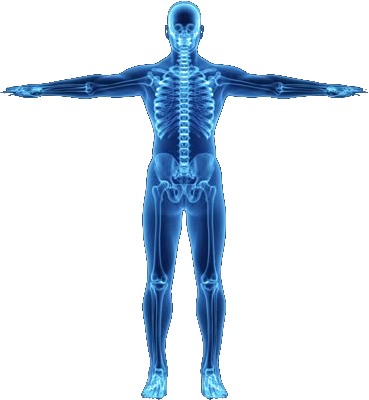
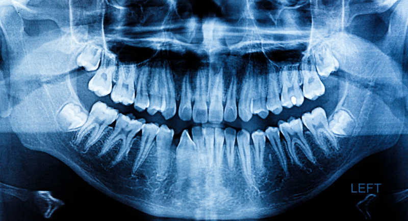

```{r setup, include = FALSE}
library(knitr)
library(tidyverse)
library(nhsrtheme)
library(xaringanExtra)
# set default options
opts_chunk$set(echo = FALSE,
               fig.width = 7.252,
               fig.height = 4,
               dpi = 300)

xaringanExtra::use_xaringan_extra(c("tile_view", "animate_css", "tachyons", "share_again"))

xaringanExtra::style_share_again(
  share_buttons = c("twitter", "linkedin"))

```

class: title-slide, left, bottom


# `r rmarkdown::metadata$title`
<hr>            <!-- horizontal line --> 

### .blue[**`r rmarkdown::metadata$subtitle`**]
#### _`r rmarkdown::metadata$author`_
.date[.grey[ `r "\U1F4C5"` _21 July 2021_ `r "\U1F5FE"` _Sendai,Japan_]]

???
Hello everyone!! My name is Upul Cooray. I am 3rd year PhD student in Tohoku University, Japan.
Here I will present how we examined the robustness of the association between oral health and general health using machine learning prediction algorithms.

---
class: inverse, middle, center

# INTRODUCTION
<hr>

---
class: one

# INTRODUCTION
<hr>

* Conventionally, .green[Oral Health] and .green[General Health] are treated as 
separate entities within health care systems.
--

* This separation exist in training personals, allocating resources, delivery of primary health care...etc.
--

* However, the link between oral  health and general health has been studied for decades.
--

* Research related to oral health and general health associations fall into 4 main categories.

---
# INTRODUCTION
<hr>
.one[* Research related to oral health and general health associations fall into 4 main categories.]

--
1. Related to oral manifestations of systemic disease
--

1. Related to-chemical links between oral infections and systemic diseases
--

1. Related to mediating effect of nutrition on the association between oral health and general health
--

1. Related to common risk factors of oral and general health problems.

---
class: inverse, middle, center

# HYPOTHESIS
<hr>
## "Intuition"
---


---
<!-- .pull-left[ -->
<!-- ] -->

<!-- .pull-right.w-50[ -->
<!-- ] -->

<!-- .w-30[ -->
<!-- ] -->

--

<!-- .w-30.fixed.right-1.bottom-1[ -->
<!-- ] -->
